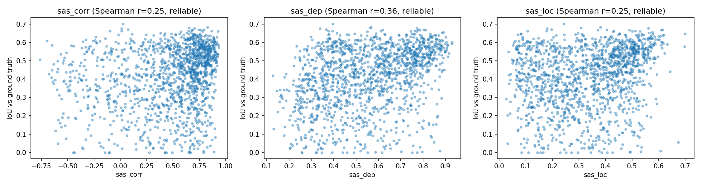
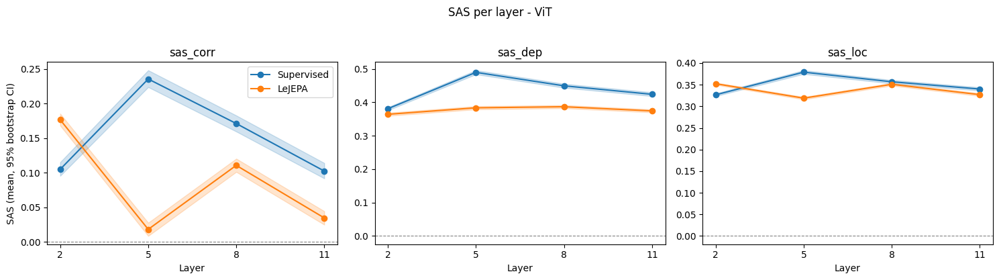
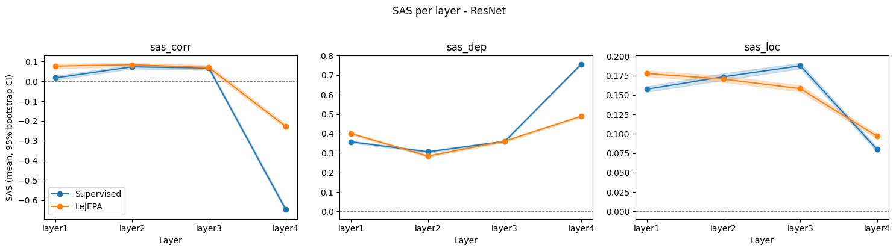

# Emerging Interpretability in LeJEPA vs. Supervised Learning 
Computer Vision course - Prof. Irene Amerini, Sapienza University of Rome

## Abstract
This project investigates the emergence of ”zero-shot” semantic segmentation in Joint Embedding Predictive Architectures (JEPAs) compared to traditional supervised models. While supervised training is driven by categorical labels, LeJEPA utilizes Sketched Isotropic Gaussian Regularization (SIGReg) to learn representations. We aim to evaluate whether the semantic structures emerging in LeJEPA’s latent space (visible via PCA) align more naturally with the model’s internal attention and gradients than those in supervised counterparts.

## 1. Experimental design
- **Models:** Four backbones are trained from scratch on ImageNet-100 (100-class subset of ImageNet-1k): ViT-S/16 and ResNet-50, each under both the supervised cross-entropy and the LeJEPA / SIGReg (multi-crop: 2 global + 6 local views for ViT, 2 global views only for ResNet) regime.
- **Explainability pipeline:** For each model, saliency is extracted with an architecture-specific XAI method (Attention Rollout for ViT, Grad-CAM for ResNet) and compared against a label-free semantic mask obtained by projecting features onto their first principal
component (PCA, PC1). Both are computed at four matched depths per backbone (transformer blocks 2/5/8/11 for ViT; layer1-layer4 for ResNet), sampling early, intermediate and late representations without checking every single layer.
- **Semantic Alignment Score (SAS):** Agreement between the saliency map and the PCA map is quantified with three independent formulations:
    1. Spearman rank correlation: A non-parametric statistical measure used to evaluate the spatial agreement between the two maps.
    2. Distance correlation: Captures non-linear dependence. Used in place of a histogram-based mutual-information estimator, which is unreliable at this sample size.
    3. AUITC (Area Under the IoU–Threshold Curve): Average IoU between the two maps thresholded at several retrained-mass levels, avoiding reliance on one fixed, arbitrarily calibrated threshold.
- **Metric calibration:** Before being applied to the LeJEPA/supervised comparison, all three SAS variants are validated independently against the real IoU between saliency and ground-truth segmentation masks (PASCAL VOC 2012, using an external pretrained DINO ViT-S/16 as the probe model). Validation includes three null-hypothesis tests (random model weights, randomly paired images, and spatial patch-shuffling) plus bootstrap confidence intervals on the correlations. 
- **In-distribution vs. out-of-distribution evaluation:** The full layer-by-layer SAS analysis is run on the ImageNet-100 validation split, then repeated unmodified on PASCAL VOC 2012 to assess whether any observed effect generalizes beyond the training distribution.

## 2. Repository structure

| File | Description |
|---|---|
| `train_supervised.ipynb` | Trains ResNet-50 / ViT-S/16 with standard cross-entropy supervision on ImageNet-100. |
| `train_lejepa.ipynb` | Trains ResNet-50 / ViT-S/16 with the LeJEPA objective (SIGReg loss) on ImageNet-100; includes a linear-probe evaluation of the frozen backbone. |
| `SAS_calibration.ipynb` | Validates the three SAS variants against real IoU-vs-ground-truth (PASCAL VOC, DINO ViT-S/16 as an external reference model, not one of the project's own checkpoints). Includes three null-hypothesis tests and bootstrap confidence intervals. |
| `SAS_lejepa_vs_sup.ipynb` | Main experiment: layer-by-layer XAI + PCA + SAS comparison between the four trained models, correct-vs-incorrect SAS gap, and an out-of-distribution replication on PASCAL VOC 2012. |
| `imagenet100.py` | Downloads ImageNet-1k (ILSVRC2012) from image-net.org and filters it down to the ImageNet-100 subset used for training and evaluation.|

**Note:** 
`train_*.ipynb` are Kaggle notebooks (developed and checkpointed for a Kaggle GPU runtime). 
`SAS_*.ipynb` are Google Colab notebooks, chosen because the evaluation
pipeline itself does not require comparable compute, only inference and lightweight statistics.

## 3. Reproducibility

### 3.1 GPU 
A CUDA-capable GPU is required for training (the reference runs used a Kaggle T4×2 instance).

### 3.2 Execution order
1. `train_supervised.ipynb` (run once per architecture: `ARCH = "resnet50"` and `ARCH = "vit_small_patch16_224"`) -> produces `best_backbone.pt` / `best_checkpoint.pt`.
2. `train_lejepa.ipynb` (same, once per architecture) -> produces `best_backbone.pt` / `linear_head.pt`.
3. `SAS_calibration.ipynb`: independent of steps 1–2 (uses an external DINO checkpoint); can be run at any time to (re-)validate the SAS metrics.
4. `SAS_lejepa_vs_sup.ipynb`: requires the four checkpoints from steps 1–2 to be available at the paths set in its Globals section.

### 3.3 Data and checkpoints
- **ImageNet-100**: expected as an `ImageFolder`-compatible `train/` and `val_filtered/` tree (obtainable via `src/imagenet100.py`). Prepared copy: [Google Drive](https://drive.google.com/drive/folders/1gpy5YcmtPiXvTMHEKhhOYxu-K4c3EeF0?usp=drive_link)
- **PASCAL VOC 2012** (segmentation, validation split): downloaded automatically by `torchvision.datasets.VOCSegmentation(download=True)`.
- **Trained checkpoints:** (all four backbones) [Google Drive](https://drive.google.com/drive/folders/18Ppa_OwjqpI1zjOPq7GaVAlGNijGmrOO?usp=sharing)

## 4. Results
**Summary:** In this specific setup/budget, the results do not support the initial working hypothesis. From the intermediate layers onward, in both ViT and ResNet architectures, the supervised model’s saliency is more aligned with its own PCA-derived semantic structure than LeJEPA’s. LeJEPA shows an advantage only at the shallowest evaluated depth in both architectures, and this trend remains consistent under out-of-distribution evaluation on PASCAL VOC.

**Note:** These results should be read together with the training-budget limitation reported below.

### 4.1 Metric calibration
Before being applied to the LeJEPA/supervised comparison, the three SAS variants were validated in `SAS_calibration.ipynb` against real ground-truth segmentation (PASCAL VOC, external pretrained DINO ViT-S/16 probe; mean saliency-vs-ground-truth IoU = 0.411, 0.436 with IoU 60% mass threshold vs. 0.459 DINO paper). All three correlate significantly with ground-truth IoU, with 95% bootstrap CIs entirely above zero.

Three null tests then probe robustness, and reveal a problem specific to `sas_dep`: under random model weights, its mean value (0.579) is higher than for the trained model (0.556) (the metric cannot tell a trained model from an untrained one) and this failure replicates across 4 independent seeds (0.60-0.68 for random weights vs. 0.556 trained). `sas_corr` and `sas_loc` behave correctly on this test (trained 0.459 / 0.335 vs. random weights -0.343 / 0.189), and all three metrics pass the remaining two null tests (randomly paired images; spatial patch-shuffling), where scores collapse toward zero as expected.

### 4.2 In-distribution (ImageNet-100)
**ViT-S/16:** LeJEPA shows an advantage only at block 2 (`sas_corr`: 0.177 vs. 0.105; `sas_loc`: 0.352 vs. 0.327), while `sas_dep` already favors the Supervised model at this depth. From block 5 onward, the Supervised model consistently achieves higher scores on all three metrics and never loses the lead. However, by block 8 the gap becomes smaller. The two approaches achieve almost identical downstream accuracy (62.8% Supervised vs. 62.9% LeJEPA using a linear probe), suggesting that the difference is not due to one backbone being weaker than the other.

**ResNet-50:** The results are more mixed. LeJEPA has a clear advantage at layer 1 (`sas_corr`: 0.077 vs. 0.017), while the two models are similar at layers 2–3. At layer 4, `sas_corr` becomes strongly negative for both models (LeJEPA: −0.227, Supervised: −0.646). This is most likely caused by the PCA sign ambiguity issue identified during calibration, rather than a real anti-alignment effect. Since `sas_loc` is not affected by sign changes, it still shows a small advantage for LeJEPA at this layer (0.097 vs. 0.080). Unlike ViT, the two ResNet models are not matched in terms of accuracy: the Supervised model reaches 79.5%, while LeJEPA reaches 66.1% with a linear probe, resulting in a 13.4-point gap. Therefore, in the CNN setting, part of the SAS difference may be related to LeJEPA having a less accurate or less mature ResNet backbone under the same training budget, rather than being caused only by the training paradigm.

### 4.3 SAS-gap
In the supervised model, correctly classified images have significantly higher SAS than misclassified ones at multiple layers (ViT: `sas_corr`/`sas_loc` significant at blocks 2 and 5; `sas_dep` significant at all four blocks; ResNet: significant at layer4 for all three metrics). In LeJEPA the same gap is close to zero and essentially never significant in ViT, reaching significance in ResNet only at the deeper layers. Semantic alignment predicts whether the supervised model's own head is correct; for LeJEPA it largely does not, consistent with a representation learned independently of any classification objective.

### 4.4 Out-of-distribution test (PASCAL VOC 2012)
The OOD test asks whether LeJEPA's alignment is less dependent on ImageNet-specific shortcuts than Supervised's, which would show up as LeJEPA degrading less when moving to VOC. Instead, 12 of 16 validated layer x metric combinations move against this hypothesis. For ResNet, `sas_loc` moves against it at all four layers (e.g. layer3: LeJEPA's ID lead of +0.029 becomes a Supervised lead of +0.055 on VOC). For ViT, the largest shift is at block 5, where Supervised's already-largest advantage grows from +0.218 (ID) to +0.256 (OOD). Looking at absolute values, Supervised's SAS mostly improves moving to VOC, while LeJEPA's is mixed with more instances of small decrease. Ground-truth IoU against real VOC masks confirms the SAS-based ranking (Supervised >= LeJEPA from the middle layers onward).

### 4.5 Qualitative highlights 
On 10 randomly sampled examples, both models' PCA maps generally identify the main object; LeJEPA shows a slight edge in background-noise suppression for ViT and a clearer advantage for ResNet, where Supervised's Grad-CAM/PCA is more often blurred or affected by background texture. Across both models, the PCA maps are consistently more similar to each other than the corresponding saliency maps (rollout / Grad-CAM) are, since PCA acts on raw token features and mostly separates foreground from background regardless of training objective, whereas rollout and Grad-CAM are directly shaped by what each model was trained to do (see `eval/*_paired_random.png`).

## 5. Limitations
- Due to Kaggle GPU-time budget constraints, all four models were trained for only 40 epochs. For comparison, the official LeJEPA implementation utilizes a 400-epoch schedule for a LeJEPA ResNet-50 on the same ImageNet-100 dataset.
- ViT-S/16 is trained from scratch with no convolutional inductive bias. Unlike ResNet-50, ViT has no built-in locality/translation-equivariance prior, so random-init training typically needs much larger datasets and/or longer schedules to match CNN performance. Here ViT-S/16 is trained from scratch on ImageNet-100 (around 130k images) for 40 epochs, well below what is typically needed for ViT to be competitive without extra data.

## 6. Others
Slides for presentation available at: [Google Drive](https://drive.google.com/drive/folders/1TPluYGZ9sT1LWR1i48szQ1-ttyMa1GHF?usp=sharing)

Other result outputs available at: [Google Drive](https://drive.google.com/drive/folders/1Qa7fq7HNJPhkjzZ3ZICFKZxgNW1USivJ?usp=sharing)

## References

- Samira Abnar and Willem Zuidema. Quantifying attention flow in transformers, 2020.
- Randall Balestriero and Yann LeCun. Lejepa: Provable and scalable self-supervised learning without the heuristics, 2025.
- Mathilde Caron, Hugo Touvron, Ishan Misra, Herv´e J´egou, Julien Mairal, Piotr Bojanowski, and Armand Joulin. Emerging properties in self-supervised vision transformers, 2021.
- Alexey Dosovitskiy, Lucas Beyer, Alexander Kolesnikov, Dirk Weissenborn, Xiaohua Zhai, Thomas Unterthiner, Mostafa Dehghani, Matthias Minderer, Georg Heigold, Sylvain Gelly, Jakob Uszkoreit, and Neil Houlsby. An image is worth 16x16 words: Transformers for image recognition at scale, 2021.
- Ramprasaath R. Selvaraju, Michael Cogswell, Abhishek Das, Ramakrishna Vedantam, Devi Parikh, and Dhruv Batra. Grad-cam: Visual explanations from deep networks via gradient-based localization. International Journal of Computer Vision, 128(2):336–359, October 2019.
- Yuhao Zhang, Mingcheng Zhu, and Zhiyao Luo. Segx: Improving interpretability of clinical image diagnosis with segmentation-based enhancement, 2025.

#### Citation & Acknowledgements
This work relies heavily on the research presented in **LeJEPA** (Lean Joint-Embedding Predictive Architecture).

Check out the official LeJEPA repository here: https://github.com/galilai-group/lejepa

Check out the 100 specific classes of ImageNet-100 here: https://huggingface.co/datasets/galilai-group/imagenet100